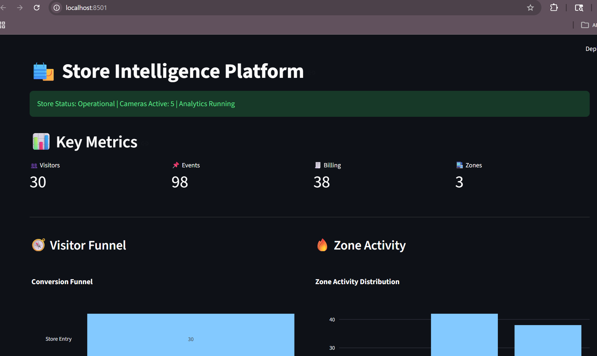
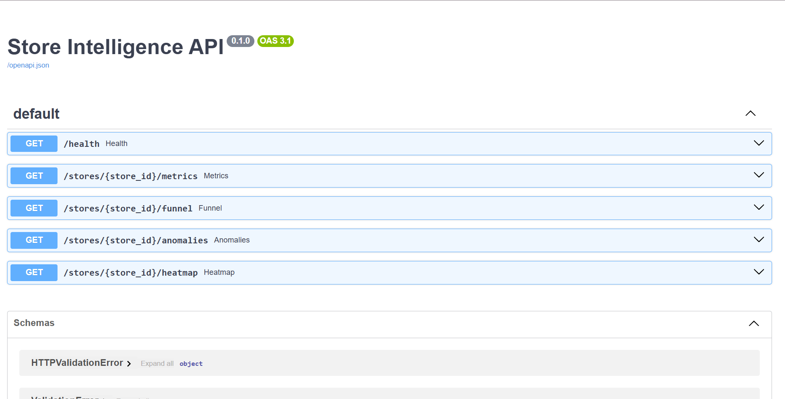

# Store Intelligence System

Purplle Tech Challenge 2026 - Round 2 Submission

## Overview

This project implements an end-to-end Store Intelligence System that transforms raw CCTV footage into actionable retail analytics.

The system performs:

* Person Detection
* Multi-Object Tracking
* Visitor Session Generation
* Event Stream Creation
* Store Analytics
* Dashboard Visualization

The solution follows a production-inspired architecture using Computer Vision, Event Processing, Analytics APIs, and a Dashboard layer.

---

## Features

### Computer Vision

* YOLOv8 Person Detection
* ByteTrack Multi-Object Tracking
* Visitor Session Generation

### Event Processing

* Event Stream Generation
* JSONL Event Storage

### Analytics APIs

* Store Metrics
* Visitor Funnel
* Heatmap Analytics
* Anomaly Detection

### Dashboard

* KPI Monitoring
* Funnel Visualization
* Zone Activity Analytics
* Anomaly Monitoring

---

## Architecture

CCTV Footage

↓

YOLOv8 Detection

↓

ByteTrack Tracking

↓

Visitor Session Builder

↓

Event Generator

↓

master_events.jsonl

↓

FastAPI Analytics Layer

↓

Streamlit Dashboard

Detailed architecture is available in:

docs/ARCHITECTURE.md

---

## Camera Mapping

| Camera | Purpose            |
| ------ | ------------------ |
| CAM 1  | Skincare Zone      |
| CAM 2  | Makeup Zone        |
| CAM 3  | Entrance Analytics |
| CAM 4  | Store Operations   |
| CAM 5  | Billing Counter    |

Detailed design:

docs/DESIGN.md

---

## API Endpoints

### Health

GET /health

### Metrics

GET /stores/{store_id}/metrics

### Funnel

GET /stores/{store_id}/funnel

### Heatmap

GET /stores/{store_id}/heatmap

### Anomalies

GET /stores/{store_id}/anomalies

Swagger:

http://127.0.0.1:8000/docs

---

## Dashboard

The Streamlit dashboard provides:

* Store KPIs
* Funnel Analytics
* Zone Activity
* Anomaly Monitoring

---

## Project Structure

store-intelligence/

├── api/

├── dashboard/

├── data/

├── docs/

├── tests/

├── requirements.txt

├── Dockerfile

└── README.md

---

## Running The Project

### Install Dependencies

```bash
pip install -r requirements.txt
```

### Start Backend

```bash
python -m uvicorn api.main:app --reload
```

### Start Dashboard

```bash
streamlit run dashboard/app.py
```

### Open Dashboard

http://localhost:8501

---
## Dashboard



## API Documentation


## Engineering Decisions

Major design choices are documented in:

* docs/CHOICES.md

---

## Assumptions

System assumptions are documented in:

* docs/ASSUMPTIONS.md

---

## Future Improvements

* Cross-camera re-identification
* Staff recognition models
* Queue abandonment detection
* Real-time event streaming
* Multi-store deployment
* Production database integration

---

## Technology Stack

### Computer Vision

* YOLOv8
* OpenCV
* ByteTrack

### Backend

* FastAPI

### Dashboard

* Streamlit

### Data Storage

* JSONL Event Store

---

Developed for Purplle Tech Challenge 2026.
